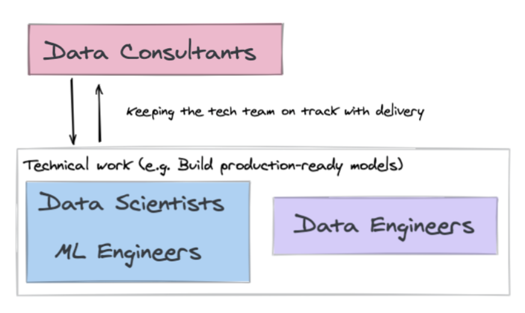

---
output:
  xaringan::moon_reader:
    seal: false
    css: xaringan-themer.css
    nature:
      slideNumberFormat: "%current%"
      highlightStyle: github
      highlightLines: true
      ratio: 16:9
      countIncrementalSlides: true
---

class: left, top, inverse
background-image: url(figures/first_page.png)
background-size: contain

# My (non linear) journey in data science


.large[Anna Quaglieri]

.medium[Industry Showcase - Statistical Society of Victoria |21 Sep 2021]


```{r setup, include=FALSE}
options(htmltools.dir.version = FALSE)
knitr::opts_chunk$set(
  fig.width=9, fig.height=3.5, fig.retina=3,
  out.width = "100%",
  cache = FALSE,
  echo = TRUE,
  message = FALSE, 
  warning = FALSE,
  hiline = TRUE
)
```

```{r xaringan-themer, include=FALSE, warning=FALSE}
# devtools::install_github("gadenbuie/xaringanExtra")

library(xaringanExtra)
library(xaringan)
library(xaringanthemer)
library(fontawesome)

style_duo_accent(
  primary_color = "#7b8e1f",
  secondary_color = "#ffffff",
  inverse_header_color = "#290502", 
  link_color = "darkmagenta",
  code_highlight_color = "#add8e6", 
  footnote_color = "black", 
  footnote_position_bottom = "40px", 
  footnote_font_size = "0.7em"
)
```

---
name: intro

## The linear path: Statistics & Bioinformatics

Bioinformatics: Data Science for biology

.center[]

---

## However...

Towards the end of my PhD, I started:

--

- Dreaming of a life where I wasn't working on weekends

--

- Feeling the Data Science FOMO (Fear Of Missing Out). 

--

.center[]
  

---

## When my path deviated from (academic) linearity


👩‍💻 At the end of 2019 I joined the AI consulting company Melbourne based [Eliiza](https://eliiza.com.au/) and postponed my postdoc start


.center[]


---

background-image: url(figures/eliiza-logo.png)
background-position: 100% 0%
background-size: 20%


## A breath of fresh air


Changing field turned out to be really stimulating vs comfortable academic family


.center[]


---

background-image: url(figures/eliiza-logo.png)
background-position: 100% 0%
background-size: 20%


## What I've learnt

--

🐍  **Python on the job**

--


🤖 **Exposure to machine learning** in action & in production. 

.pull-left[

Claim processing for an insurance company

]


.pull-right[


]


.footnote[Nib adopts machine learning for claims processing: https://www.itnews.com.au/news/nib-adopts-machine-learning-for-claims-processing-555752 (2020)]


---

background-image: url(figures/eliiza-logo.png)
background-position: 100% 0%
background-size: 20%


## What I've learnt


🐍  **Python on the job**


🤖 **Exposure to machine learning** in action & in production


💻  **Work as a team**: I was never only by myself on a project - we needed to deliver a solution as a team, usually Data Scientist + ML Engineer


.center[]


---

background-image: url(figures/eliiza-logo.png)
background-position: 100% 0%
background-size: 20%


## What I've learnt


🐍  **Python on the job**


🤖 **Exposure to machine learning** in action & in production


💻  **Work as a team**: I was never only by myself on a project - we needed to deliver a solution as a team, usually Data Scientist + ML Engineer


🛠 **DevOps**: all that is around building software that works and it gets deployed and work as expected


.center[]

---

background-image: url(figures/eliiza-logo.png)
background-position: 100% 0%
background-size: 20%


## What I've learnt


🐍  **Python on the job**


🤖 **Exposure to machine learning** in action & in production


💻  **Work as a team**: I was never only by myself on a project - we needed to deliver a solution as a team, usually Data Scientist + ML Engineer


🛠 **DevOps**: all that is around building software that works and it gets deployed and work as expected 


📙  **Project management in consulting**: The work is planned from the beginning in a very structured way: with clear goals, actions and metrics


---

## But then..

I was missing the science

.center[]

---
class: center

## Since four months

I'm a Bioinformatics Data Scientist at the Melbourne based startup [Mass Dynamics](https://www.massdynamics.com/)

--

.pull-left[

> Mass Dynamics is on a mission to free humanity and society from the burden of disease by helping more life scientists transform proteomics data to knowledge - better, faster and easier.


]

--

.pull-right[

]


---
background-image: url(figures/md-center.png)
background-position: 100% 0%
background-size: 20%

## What I actually do every day 

--

🏡💻 **Work in a fun team**: Work with a fun interdisciplinary team of scientists, developers, marketing savvy.

.center[
]


---
background-image: url(figures/md-center.png)
background-position: 100% 0%
background-size: 20%

## What I actually do every day 


🏡💻 **Work in a fun team**: Work with a fun interdisciplinary team of scientists, developers, marketing savvy.

📙 **Back to learning science**: Learn the intricacies of **mass spectrometry** (= most used technique to quantify proteins in a sample) & what life scientists need to make the best use of their experiment.

--

👩‍💻 **Develop in R & Python**: Assemble workflows in R to analyse mass spectrometry data.

--

👐 **Open Science**: Strive for reproducibility and open sourcing in what we produce.


---
name: whatme

## Summary: What I’ve learnt and what I would do differently

--

- Changing helped me became way more self-aware of what I actually enjoy

--

- I wouldn’t stress so much as I did in my last year of PhD about making the PERFECT decision for my future career

--

- I learnt to respect my free time way more and I’m so glad to be surrounded by people that share and respect this as well. 

--

- Talking and interacting with people was super valuable to find opportunities
  - I started working at Eliiza after interacting with speakers at the R-Ladies Melbourne events


---

## I found a happy place in a non linear path

Being a spline turned out to be a good fit for me. 


---
# You can fine me at


- [`r fa(name = "twitter")` @annaquagli](https://twitter.com/annaquagli)
- [`r fa(name = "github")` @annaquaglieri16](https://github.com/annaquaglieri16) 


.footnote[
These slides were created using the `{xaringan}` 📦 by Yihui Xie (2021). xaringan: Presentation Ninja. R package version 0.22. https://CRAN.R-project.org/package=xaringan 
]
